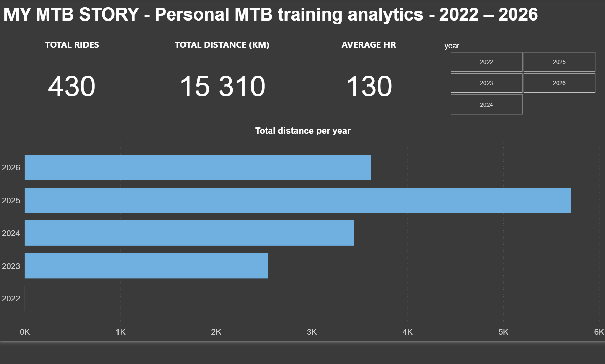

# MTB Training Analytics

Personal mountain biking training data — from raw Garmin FIT files to a full 
Python → SQL → Power BI analytics pipeline.



## Project status
✅ Core pipeline complete: 430 rides (2022–2026) parsed, cleaned, analyzed, 
and visualized. Ongoing as new rides accumulate.

## The question
Is my MTB fitness actually improving season over season — and how do I prove 
it in a way that isn't misleading?

## Key findings
- **510 rides parsed** from 18,398 raw Garmin FIT files (most files are 
  passive background monitoring, not activities); **430 confirmed as 
  mountain biking** after cleaning.
- **Clear seasonal pattern**: rides peak in May, drop to near-zero in winter.
- **Naive comparison is misleading**: average speed alone suggested fitness 
  declined in 2026 vs 2025. Adjusting for terrain difficulty using **VAM 
  (vertical ascent per hour)** revealed the opposite — 2025→2026 shows a 
  genuine fitness gain (VAM up, heart rate down), since 2026 rides covered 
  steeper terrain.
- 2022–2023 have no heart rate data (no HR sensor in use yet), so 
  year-over-year fitness comparisons start from 2024.

## Stack
- **Python** (pandas, fitparse) — parsing raw FIT files, cleaning, exploratory analysis
- **SQL** (SQLite) — storage and reproducible queries (`sql/analysis_queries.sql`)
- **Power BI** — interactive dashboard with year/month breakdowns and KPI cards

## Data source & privacy
Personal activity data exported from Garmin Connect. Raw GPS traces are 
excluded from this repo (`.gitignore`) to avoid exposing home location. 
Only aggregated metrics (distance, heart rate, elevation, speed) are shared.

## Project structure
```
├── data/
│ ├── raw/ # raw FIT exports (gitignored)
│ └── processed/ # cleaned CSVs + SQLite database
├── notebooks/
│ └── 01_exploration.ipynb # main analysis notebook
├── sql/
│ └── analysis_queries.sql # reproducible SQL analysis
├── powerbi/
│ └── mtb_dashboard.pbix # interactive dashboard
└── src/
├── parse_fit.py # FIT file parser
├── clean_data.py # data cleaning & MTB filtering
└── load_to_sql.py # loads clean data into SQLite
```
## How to reproduce
```bash
pip install -r requirements.txt
python src/parse_fit.py      # parses raw FIT files into activity summary
python src/clean_data.py     # filters to MTB rides, adds derived columns
python src/load_to_sql.py    # loads into SQLite for SQL analysis
```
Then open `notebooks/01_exploration.ipynb` or `powerbi/mtb_dashboard.pbix`.